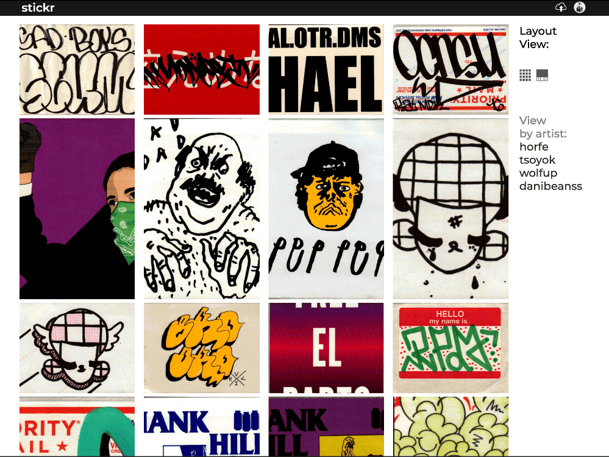

# Stickr
*by Tadeo Garcia - [Visit Stickr](http://stickr-aa.herokuapp.com)*

**Table of Contents**
- [Stickr at a glance](#Stickr-overview)
- [Technologies Used](#technologies-used)
- [Front-end Overview](#front-end-overview)
- [Back-end Overview](#back-end-overview)
- [Moving Forward](#moving-forward)

## Sticker Overview
Stickr is a fullstack web application that is inpsired by the popular photography site, [Flicker](http://www.flickr.com). 

Stickr has a focus on the graffiti community, allowing users to upload and browse stickers from other members from around the world! 


## Technologies Used
Stickr is composed of a few key technologies that help render a very user-friendly interface on the front-end, while maintaining a fast and efficient data management system on the back-end.

API calls are made from the front-end, React, portion of the application, which are then received in the back-end Express.js run server and dispatched accordingly. 

In addition, to React, Stickr is tied to Amazon Web Services which allows for users to upload and have access to their own collection of stickers.

## Front-end Overview

### React
React is the foundation of the Stickr's front-end architecture. Individual React components are used throughout the site to provide an interface that resembles that of Flickrs, with some minor adjustments that suit Stickr's functionality better. An example of this is a dual layout implementation that allows the user to either view stickers in a grid layout or a scrolling layout, depending on their preference. Below is a code snippet that shows how this is accomplished, as well as Gif showing it in action!

```
//To render the grid layout
return (
  <div classname="photo-grid-container">
        {Object.values(photoList).map((photo, index) =&gt; {
          let link = <code>/user/${photo.userId}/photo/${photo.id}</code>
          return (
            <a href="{link}" key="{index}">
              <div classname="photo-grid-item">
                <div classname="photo">
                  <singlegridcomponent url="{photo.url}"/>
                </div>
              </div>
            </a>
          )
        }
        )}
  </div>
 );
```


### Redux
Redux is also a key ingredient in the front-end's implementation. Redux, react-redux, and redux-thunk work together to manage the application's sstate. With the use of state, Stickr is able to access stickers, and is able to render them fast and efficiently depending on how the React component dispatches and stores them in the Redux store.

All of the front-end technologies listed above, in tandem with AWS, allow the user to upload pictures to their account and add them to their collection!




## Back-end Overview

## Express.js
The back-end portion of Stickr is a minimal, but very effective server created by using the Express.js framework. The models, migragtions and seed files are made using Sequelize and its command line interface (CLI).
Those two technologies work in conjunction with a PostgreSQL database, which provide several different relationships among our data models. Creating custom queries, with the help of the relationships, allows Stickr's backend to send data for 1 sticker, all stickers, all stickers that belong to one user, and all other combinations in between.

The following code shows how to retrieve all the photos for one user:

```
router.get('/:id/photos', asyncHandler(async function (req, res, _next) {
  const userId = req.params.id; 
  const photos = await Photo.findAll({ where: { userId } }) 
  res.json({ photos }); 
}));
```

Lastly, in order to post users' photos to AWS, the multer and multerS3 middlewares had to be used in conjunction with the corresponding API endpoints, to configure and access the appropriate AWS3 storage bucket. The following code snippet shows a portion of the configuration and publishing process to AWS3.

```
const multerS3Config = multerS3({ 
  s3: s3, bucket: "stickr-app", 
  metadata: function (req, file, cb) { 
    cb(null, { fieldName: file.fieldname });
     }, 
  key: function (req, file, cb) { 
    cb(null, new Date().toISOString() + "-" + file.name); 
    },
});

const upload = multer({ 
  storage: multerS3Config,
  fileFilter: fileFilter, 
  limits: { fileSize: 1024 _1024_ 5 
  } 
});

const singlePublicFileUpload = async (file, userId) => { 
  const { originalname, mimetype, buffer } = await file; 
  const path = require("path"); 
  const Key = 'users/' + userId + '/' + new Date().getTime().toString() + path.extname(originalname); 
  const uploadParams = { 
    Bucket: "stickr-app", 
    Key, Body: buffer, 
    ACL: "public-read" }; 
    const result = await s3.upload(uploadParams).promise();
 return result.Location;
};

const storage = multer.memoryStorage({ 
  destination: function (req, file, callback) { 
    callback(null, ""); 
    } 
});

const singleMulterUpload = (nameOfKey) => multer({ storage: storage }).single(nameOfKey);

router.post("/", singleMulterUpload("file"), asyncHandler(async (req, res) => { 
  const photoData = req.body; 
  const description = req.body.description; 
  const userId = req.body.id;

  photoData.url = await singlePublicFileUpload(req.file, userId);
  const url = photoData.url
  const photo = await Photo.create({description, url, userId})
  return res.json ({ photo })
  }) 
);
```

## Moving Forward
First, thank you for reading this far into this Readme, I really appreciate you taking the time to do so. Second, I'd like to share some of the following features that I hope to implement in the near future. To begin I'd like to add 'likes' to the pictures, and then be able to sort them by most likes. Additionally, I will implement the ability for users to follow other users, so as the community grows the user feed is specifically made up of stickers that the user wants to see of other users they follow. Lastly, I would like to implement some sort of messaging system for users to communicate. Again, thank you for taking the time to check out the project, I hope you enjoyed it and the art as much as I do!